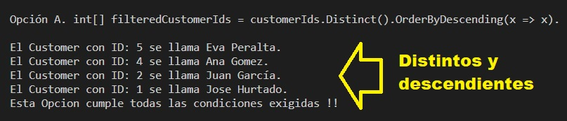
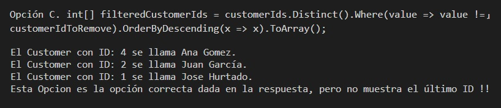

# Ejercicios Propuestos para el Examen de CSharp

## Entregar el url de GitHub con la solución y un readme con las siguiente información:

1. **Nombres y apellidos:** Carlos
2. **Fecha:** 30 de Octubre 2020.
3. **Resumen de la Entrega:** La tarea individual consta de 15 ejercicios individuales a mi han tocados los siguientes:

##  Ejercicio CSharp No. 41
Las condiciones generales del ejercicio:

### Archivos:
- Archivo con el planteamiento del ejercicio en formato html:
[Ejercicio CSharp No. 41 - HTML](https://escribe aquí tu github/Ejer-CSharp-No-16.html)

### Código:

- Archivo con el código CSharp para la solución del ejercicio:
[Ejercicio CSharp No. 41 - C\#](./CSharp-Codigo/Ejer-CSharp-No-41/Ejer-No-41.cs)

---
##  Ejercicio CSharp No. 58
Las condiciones generales del ejercicio:

### Archivos:
- Archivo con el planteamiento del ejercicio en formato html:
[Ejercicio CSharp No. 58 - HTML](https://escribe aquí tu github/Ejer-CSharp-No-58.html)

### Código:

- Archivo con el código CSharp para la solución del ejercicio:
[Ejercicio CSharp No. 58 - C\#](./CSharp-Codigo/Ejer-CSharp-No-58/Program.cs)

### Resultado:

- La representación visual de la resolución del ejercicio se muestra en la siguiente imagen:

---
##  Ejercicio CSharp No. 75
Las condiciones generales del ejercicio:

### Archivos:
- Archivo con el planteamiento del ejercicio en formato html:

[Ejercicio CSharp No. 75 - HTML](https://escribe aquí tu github/Ejer-CSharp-No-75.html)

### Código:
- Archivo con el código CSharp para la solución del ejercicio:
[Ejercicio CSharp No. 75 - C\#](./CSharp-Codigo/Ejer-CSharp-No-75/Program.cs)

### Resultado:

- La representación visual de la resolución del ejercicio se muestra en la siguiente imagen:

- La representación visual de la resolución del ejercicio se muestra en la siguiente imagen:

---
##  Ejercicio CSharp No. 92

Las condiciones generales del ejercicio:

### Archivos:
- Archivo con el planteamiento del ejercicio en formato html:
[Ejercicio CSharp No. 92 - HTML](https://escribe aquí tu github/Ejer-CSharp-No-92.html)

### Código:
- Archivo con el código CSharp para la solución del ejercicio:
[Ejercicio CSharp No. 92 - C\#](./CSharp-Codigo/Ejer-CSharp-No-92/Program.cs)

### Resultado:

- La representación visual de la resolución del ejercicio se muestra en la siguiente imagen:

- La representación visual de la resolución del ejercicio se muestra en la siguiente imagen:

---
##  Ejercicio CSharp No. 109

Las condiciones generales del ejercicio:

### Archivos:
- Archivo con el planteamiento del ejercicio en formato html:
[Ejercicio CSharp No. 109 - HTML](https://escribe aquí tu github/Ejer-CSharp-No-109.html)

### Código:
- Archivo con el código CSharp para la solución del ejercicio:
[Ejercicio CSharp No. 109 - C\#](./CSharp-Codigo/Ejer-CSharp-No-109/Program.cs)

### Resultado:

- La representación visual de la resolución del ejercicio se muestra en la siguiente imagen:

- La representación visual de la resolución del ejercicio se muestra en la siguiente imagen:

- Aqui se agrega el ensamblado para poder realizar el ejercicio. El ensamblado se guarda en una carpeta llamada 'Dll-Folder'. La representación visual de este paso del ejercicio se muestra en la siguiente imagen:

---